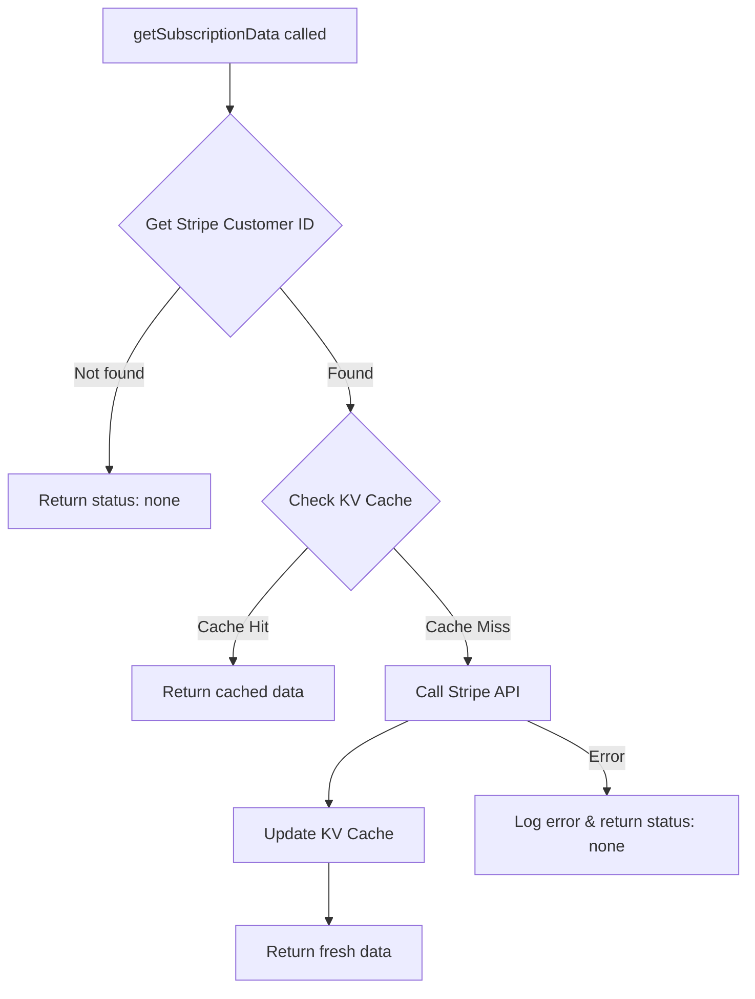

# Stripe Subscription Data with KV Cache

This module provides a resilient way to fetch Stripe subscription data with automatic KV cache fallback.

## Problem

When using KV (Key-Value) stores with eviction enabled, cached subscription data can be removed when the store reaches its memory limit. Without proper handling, this would result in missing subscription data.

## Solution

The `getSubscriptionData` function implements a cache-aside pattern that:

1. **Attempts to read from KV cache first** - Fast and reduces Stripe API calls
2. **Falls back to Stripe API on cache miss** - Ensures data is always available
3. **Repopulates the cache automatically** - Future requests will be fast again
4. **Handles errors gracefully** - Returns safe defaults if Stripe is unavailable

## Usage

```typescript
import { getSubscriptionData } from './getSubscriptionData';

// Get subscription data for an organization
const subscriptionData = await getSubscriptionData(organizationId);

if (subscriptionData.status === 'none') {
  // No subscription exists
} else if (subscriptionData.status === 'active') {
  // Active subscription
  console.log('Price ID:', subscriptionData.priceId);
  console.log('Renews:', new Date(subscriptionData.currentPeriodEnd! * 1000));
}
```

## API

### `getSubscriptionData(organizationId: string): Promise<STRIPE_SUB_CACHE>`

Fetches subscription data for an organization. Returns either:

- `{ status: 'none' }` - No subscription exists
- Full subscription object with status, pricing, and payment details

### `invalidateSubscriptionCache(organizationId: string): Promise<void>`

Removes cached subscription data, forcing the next read to fetch fresh data from Stripe.

## How It Works



## Benefits

1. **Resilient to KV eviction** - Always returns data even if cache is cleared
2. **Reduces Stripe API calls** - Uses cache when available
3. **Self-healing** - Automatically repopulates cache after eviction
4. **Error handling** - Gracefully handles Stripe API failures
5. **Type-safe** - Full TypeScript support with STRIPE_SUB_CACHE type
